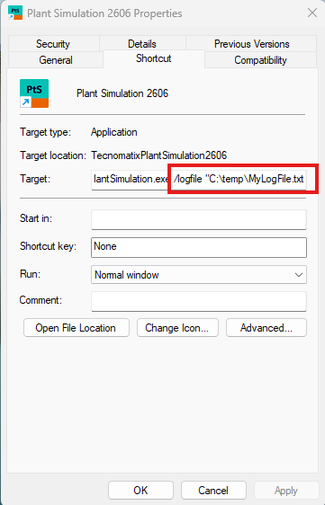
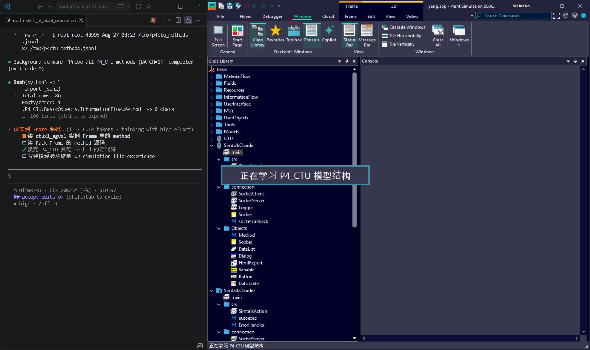
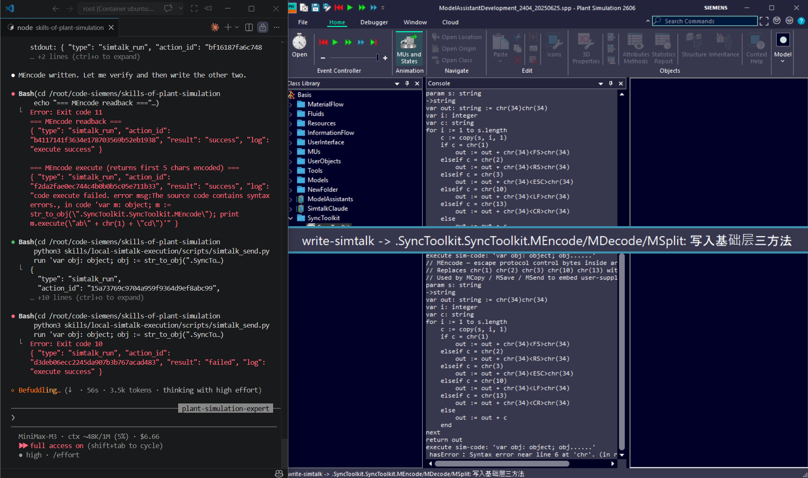

# skills_of_plant_simulation

A collection of **Claude Code / OpenClaude skills and agents** for Siemens Tecnomatix Plant Simulation — local SimTalk execution over TCP, OS-function reference, model-structure extraction, and write-side model mutation. Skills drive a running Plant Simulation process to obtain real execution results, and reuse the bundled knowledge base (`01-plantsimulation-knowledge/`) and the experience log (`02-simulation-file-experience/`) as the authoritative data sources.

## Directory Structure

```
skills_of_plant_simulation/
├── 01-plantsimulation-knowledge/                       # Knowledge base — Plant Simulation Help as Markdown
│   ├── 01-plant-simulation-help/
│   │   ├── getting-to-know-plant-simulation/
│   │   ├── objects/                                    # By category: common, fluid, information-flow, material-flow, resource, user-interface
│   │   ├── simtalk/                                    # Language, control flow, data types, predefined functions, 3D, ...
│   │   └── step-by-step/                               # Tutorials — modeling workflow, material flow, graphics, transport, fluids, ...
│   ├── 02-official-psfm-model/                         # Official PSFM reference models + SimTalkClaude client lib
│   │   ├── Factory51/
│   │   ├── Small-Parts-Production/
│   │   └── SimTalkClaude/                              # SimtalkClaude2606.pslib — load into Plant Simulation to enable `.SimtalkClaude.*` scripting
│   ├── prompts/
│   ├── scripts/
│   ├── LICENSE
│   └── README.md
├── 02-simulation-file-experience/                      # Practical notes — case studies, integration patterns, call playbook
│   ├── 01-domain-concepts/         # PS 领域知识（与模型无关）
│   ├── 02-bridge-tool/             # SimtalkClaude 桥 v1+v2
│   ├── 03-workflow-playbook/       # 跨 9 skill 的工作流
│   ├── 04-model-case-studies/      # 3 个真实模型案例
│   └── 05-session-archives/        # 一次性 session 报告
├── 03-agent-memory/                                    # Cross-session memory for agents
│   └── plant-simulation-expert-memory/
├── 04-simtalkclaude-client/                            # Vendored SimTalkClaude.pslib — load into Plant Simulation to enable `.SimtalkClaude.*` scripting
│   └── SimtalkClaude.pslib
├── skills/                                             # Skills — one directory per skill
│   ├── local-simtalk-execution/                       # Local SimTalk execution over TCP (transport layer base)
│   ├── local-simtalk-os-functions/                     # SimTalk OS-function reference & live probing
│   ├── local-simtalk-get-folder-tree/                  # Model object hierarchy → JSON tree
│   ├── local-simtalk-get-class-inheritance/            # Class inheritance structure (parent → children)
│   ├── local-simtalk-read-library/                     # Read Method source (metadata + program)
│   ├── local-simtalk-class-management/                 # Write: derive / duplicate / rename / delete / move classes
│   ├── local-simtalk-modify-object-attribute/          # Read & write: object attributes (with verify & restore)
│   ├── local-simtalk-add-note-to-method/               # Write: insert comment lines into a Method
│   ├── local-simtalk-create-method-object/             # Write: insert an empty Method container at `<frame>.<name>`
│   └── local-simtalk-write-simtalk/                    # Write: write SimTalk source code into a Method
├── agents/                                             # Agent definitions (invoked via the Agent tool with subagent_type)
│   ├── README.md                                       # Agents overview, install, naming convention
│   ├── plant-simulation-expert.md                      # Domain expert — picks skills, consults KB, writes usage logs
│   ├── plant-simulation-experience-curator.md         # Curator — dedupes session summaries / skill logs, decides what to promote into 02-simulation-file-experience/
│   ├── skills-optimizer.md                             # Self-maintenance agent — scans skill logs, produces optimizer reports
│   ├── optimizer-reports/                              # Reports produced by skills-optimizer (per-skill + INDEX)
│   └── curator-reports/                                # Reports produced by plant-simulation-experience-curator
├── data/                                               # Raw datasets (e.g. extracted Method signatures)
│   └── methods_raw.tsv
├── docs/
│   └── skill-authoring.md                              # Skill authoring spec
└── scripts/
    ├── install.sh                                      # One-shot install (skills + agents symlinks)
    ├── link-skills.sh                                  # Symlink skills only
    └── link-agents.sh                                  # Symlink agents only
```

## Skills

One TCP-transport skill sits at the bottom; the other 9 build on it, grouped by **read** vs **write** side.

### Transport

| Skill | Description |
|---|---|
| `local-simtalk-execution` | Connect over TCP to a Plant Simulation process running on the local host / LAN and execute SimTalk code (syntax check, method invocation, object queries, model run, exception diagnosis), returning real execution results |

### Read-only Inspection

| Skill | Description |
|---|---|
| `local-simtalk-get-folder-tree` | Extract the object hierarchy (Frame / Folder / material flow / Method / Variable) of the currently loaded model (`.current`) into a structured JSON tree |
| `local-simtalk-get-class-inheritance` | Query `Origin` / `OriginRoot` / `Class` / `InternalClassType` for each candidate class and render the parent → children inheritance map; list user-derived classes |
| `local-simtalk-read-library` | Read metadata (path / name / type / Encrypted / HasSyntaxError / NumInExecution) of all Method objects plus the full `&Method.Program` source |
| `local-simtalk-os-functions` | Reference and live-probe assistant for SimTalk predefined OS functions (memory / process / directory / env vars / registry / files / clipboard / external process / system commands, etc.) |

### Write-side Mutation

| Skill | Description |
|---|---|
| `local-simtalk-class-management` | derive / duplicate / rename / delete / move classes in the Class Library, and manage user-defined attributes (createAttr / deleteAttr / setAttribute / inheritAttribute) |
| `local-simtalk-modify-object-attribute` | **read → write → read → restore** a single attribute on one object (boolean / integer / real / string / dateTime / time / object ref), with read-back verification after each write |
| `local-simtalk-add-note-to-method` | Insert comment lines (`--` / `//` / `/* */`) into a Method's `program` — **preserves original executable code byte-for-byte**, only appends |
| `local-simtalk-create-method-object` | Insert an empty Method container at `<frame>.<name>` — validates frame path, parent class (default `.InformationFlow.Method`), method name (rejects SimTalk reserved words & collisions); **only creates, never writes code** — pair with `local-simtalk-write-simtalk` afterwards |
| `local-simtalk-write-simtalk` | Write full SimTalk source code into a Method: existing Method → modify `program` directly; new Method → first invoke `local-simtalk-create-method-object`, then write |

### Dependency Graph

```
local-simtalk-execution                ← Transport layer base (the other 8 depend on it)
        │
        ├── local-simtalk-os-functions
        ├── local-simtalk-get-folder-tree
        │       │
        │       ├── local-simtalk-get-class-inheritance
        │       └── local-simtalk-read-library
        │
        ├── local-simtalk-class-management
        │       └── local-simtalk-create-method-object
        ├── local-simtalk-modify-object-attribute
        └── local-simtalk-add-note-to-method
                └── local-simtalk-write-simtalk
```

> All hard rules that can hang the system (the `type` field whitelist, modal traps, response framing, WSL2 connection quirks, etc.) are maintained centrally in `local-simtalk-execution/references/lifelines.md`. To change a hard rule, edit only that one file.

## Agents

| Agent `subagent_type` | Description | File |
|---|---|---|
| `plant-simulation-expert` | Plant Simulation / SimTalk / model-operation domain expert: pre-flights the SimTalkClaude TCP listener, picks skills per request, consults the knowledge base (`01-plantsimulation-knowledge/`) and the experience log (`02-simulation-file-experience/`), writes per-skill usage logs under `skills/<skill>/log/`, and writes a session summary to `03-agent-memory/plant-simulation-expert-memory/` | [`agents/plant-simulation-expert.md`](agents/plant-simulation-expert.md) |
| `plant-simulation-experience-curator` | Experience curator: dedupes / classifies / indexes session summaries and per-skill logs, decides which findings are worth permanently promoting into the append-only regions of `02-simulation-file-experience/`. Writes reports to `agents/curator-reports/` (single report + INDEX). **Does NOT edit `02-simulation-file-experience/` body** — every promotion proposal is gated by user (or `verification`) review | [`agents/plant-simulation-experience-curator.md`](agents/plant-simulation-experience-curator.md) |
| `skills-optimizer` | Repository self-maintenance agent: scans `skills/<skill>/log/`, `usage_log/`, and `code_log/` for repeated failure modes, undocumented Quirks, and validated best practices, runs a gap analysis against `SKILL.md` + `references/`, and emits structured optimizer reports into `agents/optimizer-reports/<skill>-YYYY-MM-DD.md` (plus an INDEX). **Read-only** — never edits `SKILL.md` / scripts / references without user approval | [`agents/skills-optimizer.md`](agents/skills-optimizer.md) |

Invocation example:

```text
Agent(
  subagent_type: "plant-simulation-expert",
  description: "<task summary>",
  prompt: "<specific task>"
)
```

See [`agents/README.md`](agents/README.md) for the full overview, naming convention, and the Skills-vs-Agents comparison.

## Install & Use

### One-shot Install

```bash
# Clone
git clone <repo-url>
cd skills_of_plant_simulation

# One-shot symlink skills + agents into user-level dirs (recommended)
bash scripts/install.sh

# Skills only
bash scripts/install.sh --skills-only

# Agents only
bash scripts/install.sh --agents-only

# Uninstall (removes only symlinks created by this script, never the real files)
bash scripts/install.sh --unlink
```

### Manual Install

```bash
# Symlink skills only
bash scripts/link-skills.sh

# Symlink agents only
bash scripts/link-agents.sh

# Remove the corresponding links
bash scripts/link-skills.sh --unlink
bash scripts/link-agents.sh --unlink
```

### Target Dirs

| Resource | Default target | Override env var |
|---|---|---|
| skills | `~/.claude/skills/` | `$CLAUDE_SKILLS_DIR` (used by `scripts/link-skills.sh`) |
| agents | `~/.openclaude/agents/` (falls back to `~/.claude/agents/` if `~/.openclaude` does not exist) | `OPENCLAUDE_AGENTS_DIR` |

> The installer **only creates symlinks** — it does not copy or move any source files. After a repo update, the next `Skill` / `Agent` call sees the latest content automatically. But keep the repo directory layout intact; otherwise repo-root-relative paths (e.g. `01-plantsimulation-knowledge/...`) will break.


## How to Use

Install makes the skills/agents *visible* to Claude Code / OpenClaude. This chapter is about the **runtime side** — what you need running, how to actually invoke the toolchain, and a typical end-to-end workflow.

### Prerequisites (runtime)

Before any skill can do real work, three things must be true:


1. **Plant Simulation's Windows shortcut has the `/logfile` flag** so Claude can tail the runtime log. Edit the shortcut → **Target** field and append the flag (preserving any existing arguments), e.g.:
   ```
   "C:\Program Files\Siemens\Tecnomatix\Plant Simulation X\Plant Simulation.exe" /logfile "C:\temp\MyLogFile.txt"
   ```
   Make sure `C:\temp\` exists and the user has write permission; without this flag Plant Simulation does not write a log file that Claude can read.
   
   
2. **Plant Simulation is running** (locally on the host, or on a LAN-reachable machine) with the `SimtalkClaude.pslib` library loaded. That library exposes the `.SimtalkClaude.*` scripting API that the TCP listener hooks into.
3. **The SimtalkClaude TCP listener is up** — a JSON-over-TCP server bound to some `host:port` (default is usually `127.0.0.1:50007`; in WSL2 you must reach the host via `host.docker.internal:50007`, see `skills/local-simtalk-execution/references/lifelines.md` §1).

To verify the listener is alive without invoking any agent:

```bash
python3 skills/local-simtalk-execution/scripts/simtalk_send.py \
  --host <host> --port <port> \
  --type ping
```

A successful round-trip echoes the `action_id` back. Exit code `2` = cannot connect, `1` = timeout — both mean the listener isn't reachable, not that the skill is broken.

### Two ways to use the toolchain

| Path | Tool | When to use it |
|---|---|---|
| **Expert agent (recommended)** | `Agent(subagent_type="plant-simulation-expert", …)` | Open-ended tasks in natural language: "explain how Factory51 buffers work", "run method `.M.reset` and report errors", "add a comment to `Line.init`" |
| **Direct skill** | `Skill(<skill-name>)` | You already know which single skill does the job and want a one-shot, low-ceremony invocation |

The expert agent picks the right skill for you, consults the knowledge base (`01-plantsimulation-knowledge/`) and the experience log (`02-simulation-file-experience/`), and writes a per-skill usage log under `skills/<skill>/log/`. The direct-skill path skips all of that — pick the skill name from the table above and let it run.

### Invoking the expert agent

```text
Agent(
  description: "<one-line task summary>",
  prompt: "<what you want done, in natural language>",
  subagent_type: "plant-simulation-expert"
)
```

Concrete examples:

```text
Agent(
  description: "List the model hierarchy",
  prompt: "Connect to 127.0.0.1:50007 and give me the folder tree of the currently loaded model as JSON.",
  subagent_type: "plant-simulation-expert"
)

Agent(
  description: "Add a header comment",
  prompt: "Insert a 3-line comment at the top of Method .Models.Frame.Method.init explaining what it does. Preserve existing code byte-for-byte.",
  subagent_type: "plant-simulation-expert"
)
```

The agent will pre-flight the TCP connection, pick the matching skill (here: `local-simtalk-get-folder-tree` and `local-simtalk-add-note-to-method` respectively), execute, return the result to your main conversation, and write a log to `skills/<that-skill>/log/YYYY-MM-DD_<topic>.md`.

### Invoking a skill directly

When you already know which skill to use, the `Skill` tool is one line:

```text
Skill(skill="local-simtalk-get-folder-tree")
```

Read the skill's `SKILL.md` first — every skill documents its own preconditions, hard rules (some live in `references/lifelines.md`), message schema, and exit codes.

### Typical end-to-end workflow

A realistic Plant Simulation task almost always chains **read → act → verify**. Example: "find every Method with a syntax error and tell me which line".

1. **Discover the model shape** — `local-simtalk-get-folder-tree` (or `local-simtalk-get-class-inheritance` for class hierarchies).
2. **List candidate Methods** — `local-simtalk-read-library` returns `HasSyntaxError` per Method.
3. **Pull the failing source** — for each broken Method, re-run with `local-simtalk-execution` (`type: "simtalk_syntax"`) to get compiler line/column.
4. **Fix and write back** — `local-simtalk-write-simtalk` (or `local-simtalk-add-note-to-method` for comments only).
5. **Re-verify** — repeat step 3; confirm `"hasError" not in result` before declaring success.

The `simtalk_run` verdict is **double-gated** (`lifelines.md` §6): `result == "success" AND log does not start with "code execute failed"`. Treat either failure mode as "did not run".

### Hard rules worth knowing up front

These are called out across the skill docs but bite everyone the first time:

- **Unknown `type` value in the JSON message → socket hangs silently until timeout** (Quirk #13 in `lifelines.md`). The whitelist lives in `references/message-schema.md`.
- **Delimiter mode is the default** for the TCP transport. Use `--resp-mode delimiter --resp-delimiter '||END||'` unless you have a reason not to.
- **Modal traps** (`prompt`, `infoBox`, writing undeclared attributes) will freeze the Plant Simulation GUI. Replace with local `var` + `print(...)` when scripting headlessly.
- **`readlog` is unreliable on v15+** (regression). Don't put it in a loop — read the GUI Console directly when you need `print(...)` output.

Any change to these rules happens only in `skills/local-simtalk-execution/references/lifelines.md`.

## Screenshots





## Videos

Example walkthroughs of the write-side skills in action.

### 1. Add a comment to a Method (`local-simtalk-add-note-to-method`)


### 2. Add multiple comment lines (`local-simtalk-add-note-to-method`)


### 3. Write a full SimTalk program — A* path finder (`local-simtalk-write-simtalk`)


### 4. Create a new Marker object (`local-simtalk-create-method-object`)


## Path Convention

All skills and agents reference the knowledge base via repo-root-relative paths, e.g. `01-plantsimulation-knowledge/01-plant-simulation-help/objects/`. See [`docs/skill-authoring.md`](docs/skill-authoring.md) for the skill-authoring spec. **No hardcoded `/root/...` paths anywhere** — Python scripts resolve sibling skills via `os.path.realpath(__file__)`, so symlinked scripts work from any cwd.

## Cross-session Memory

- **Per-session summaries** (`plant-simulation-expert`): `03-agent-memory/plant-simulation-expert-memory/YYYY-MM-DD_session-summary_*.md`
- **Per-skill usage logs** (written by `plant-simulation-expert`): `skills/<skill-name>/log/YYYY-MM-DD_<short-topic>.md`
- **Optimizer reports** (written by `skills-optimizer`): `agents/optimizer-reports/<skill>-YYYY-MM-DD.md` and `agents/optimizer-reports/INDEX.md`
- **Curator reports** (written by `plant-simulation-experience-curator`): `agents/curator-reports/YYYY-MM-DD-curator-report.md` and `agents/curator-reports/INDEX.md`

## License & Copyright

- **Apache License 2.0** — see [LICENSE](LICENSE).
- Knowledge base content: sourced from Siemens *Plant Simulation Help* (© 2026 Siemens, Unpublished work), for learning and knowledge management only; all rights belong to Siemens.
